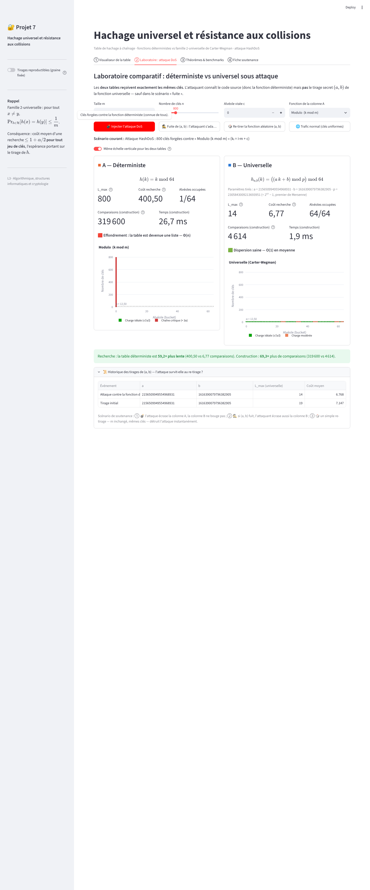

# Projet 7 — Hachage universel et résistance aux collisions

Démonstrateur interactif (Streamlit + Plotly) pour le module *Algorithmique, structures informatiques et cryptologie* (L3).

**L'idée en une phrase :** une table de hachage dont la fonction est fixée à l'avance peut toujours être piégée par des clés bien choisies (attaque HashDoS) ; si la fonction est tirée au hasard dans une famille 2-universelle, aucun jeu de clés n'est mauvais en moyenne.



## Les quatre onglets

| Onglet | Contenu |
|---|---|
| ① Visualiseur | Alvéoles colorées (idéale / modérée / critique), α, `L_max`, longueur moyenne, cases vides (comparées à `e^(−α)`), insertion / recherche / suppression avec le nombre exact de comparaisons et la chaîne parcourue |
| ② Laboratoire DoS | `k mod m` (ou Knuth) et Carter-Wegman côte à côte sur les mêmes clés ; attaque `k_i = i·m + c` en un clic ; attaquant qui connaît `(a, b)` ; re-tirage de `(a, b)` qui détruit l'attaque sans changer `m` |
| ③ Théorèmes & benchmarks | Fréquence empirique de `h(x) = h(y)` sur `N` tirages comparée à `1/m` et à la probabilité exacte ; coût de recherche en fonction de `n` (Θ(n) contre O(1)) ; coût de construction Θ(n²) sous attaque |
| ④ Fiche soutenance | Définition, théorème de Carter-Wegman et sa preuve, matrice comparative (chaînage, adressage ouvert, AVL, rouge-noir), questions pièges du jury |

## Organisation du code

| Fichier | Rôle |
|---|---|
| `app.py` | L'interface Streamlit (aucune logique algorithmique) |
| `moteur.py` | Le moteur en Python pur, typé : table à chaînage instrumentée, fonctions de hachage, jeux de données, attaques, expériences |
| `tests/test_moteur.py` | Les tests du moteur |
| `requirements.txt` | Les dépendances pour Streamlit Cloud |

## Lancer en local

Python 3.10 ou plus récent.

```
python -m venv .venv
source .venv/bin/activate          # Windows : .venv\Scripts\activate
pip install -r requirements.txt
streamlit run app.py               # ouvre http://localhost:8501
python -m unittest                 # les tests
```

## Publier sur Streamlit Community Cloud

1. Sur [share.streamlit.io](https://share.streamlit.io), se connecter avec GitHub puis *Create app → Deploy a public app from GitHub*.
2. Choisir ce dépôt, la branche `main` et le fichier principal `app.py` ; dans *Advanced settings*, choisir Python 3.12.
3. *Deploy*. Chaque `git push` sur `main` redéploie l'application automatiquement.

Conseil pour la soutenance : activer « Tirages reproductibles » dans la barre latérale pour rejouer exactement la même démonstration.

## Points à savoir expliquer

- **La garantie porte sur une espérance, pas sur chaque tirage.** Sur des clés en progression arithmétique, la loi du coût selon `(a, b)` est à queue lourde : la plupart des tirages font mieux que `1 + α/2`, de rares tirages bien pire. Le remède : re-tirer la fonction.
- **L'adversaire gagne contre toute fonction qu'il connaît**, même universelle (bouton « Fuite de (a, b) »). La protection vient du secret du tirage.
- **Sur des clés favorables, `k mod m` peut faire mieux** (clés consécutives) : le hachage universel ne vise pas le meilleur cas, il supprime le pire.
